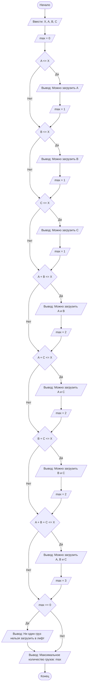

## Отчет по лабораторной работе №1

#### № группы: ПМ-2601

#### Выполнил: Павловская Анастасия Андреевна

#### Вариант 18.

### Содержание:

### 1. Постановка задачи

- Условия задачи

> В лифт с грузоподъемностью Х пытаются загрузить грузы весом A, B, C. Проверить, какие из грузов могут быть загружены в лифт без превышения допустимой массы, и определить, сколько грузов можно поместить в лифт. На вход программы подаются натуральные числа X, A, B, C.

Необходимо на вход подать 4 натуральных числа. Всего 3 груза, поэтому вариантов поместить грузы 7:
1. Поместили только груз А
2. Поместили только груз B
3. Поместили только груз C
4. Поместили А и B
5. Поместили B и C
6. Поместили C и A
7. Поместили A, B, C.

Сумма грузов должна быть <= X. 
Нужно будет создать переменную, в которую будем записывать максимальное количество грузов, которые удалось поместить.

### 2. Входные и выходные данные

- Входные данные:
В условии задачи указано, что на вход подается 4 натуральных числа, значит они целые и > 0. 

| | Тип | min значение | max значение |
| --- | --- | --- | --- |
| X(1 число) | Целое число | 1 | 10^9 |
| A(2 число) | Целое число | 1 | 10^9 |
| B(3 число) | Целое число | 1 | 10^9 |
| C(4 число) | Целое число | 1 | 10^9 |


- Выходные данные:
Будем выводить строки и максимальное число грузов (создадим переменную max), помещенных в лифт (целое число - int).

| | Тип | min значение | max значение |
| --- | --- | --- | --- |
| max(макс. число грузов) | Целое число | 0 | 3 |


### 3. Выбор структуры данных
Программа получает на вход 4 натуральных числа. Каждое из них должно не превышать 10<sup>9</sup>. Но тогда возможно, что при большой грузоподъемности их сумма будет выходить за границы целочисленного типа данных int.  Поэтому для X, A, B, C используем тип long. Для максимального количества грузов - int, потому что грузов всего только 3.

| | Название переменной | Тип (в Java) | 
| --- | --- | --- | 
| X(1 число) | 'X' | 'long' |
| A(2 число) | 'A' | 'long' |
| B(3 число) | 'B' | 'long' |
| C(4 число) | 'C' | 'long' |
| max(макс. число грузов) | 'max' | 'int' |

### 4. Алгоритм

1. **Ввод данных**
   Программа считывает четыре натуральных числа, обозначенных как X, A, B, C.

2. **Проверки**
   Создается переменная max, которая отвечает за количество грузов, которые можно поместить в лифт.

   - Совершается первая проверка для первого груза А:
     если А <= X, то груз A поместить в лифт можно, что и выводит программа на экран. Переменная max принимает значение 1.
   Две следующие проверки для грузов B и C аналогичны.

   - Четвертая проверка для суммы масс грузов A + B:
     если A + B <= X, то грузы A и B поместить в лифт можно, что и выводит программа на экран. Переменная max принимает значение 2.
   Две следующие проверки для A + C и B + C аналогичны.

   - Седьмая проверка для суммы масс грузов A, B, C:
   - если A + B + C <= X, то грузы A, B, C поместить в лифт можно, что и выводит программа на экран. Переменная max принимает значение 3.
  
   - Последняя проверка обрабатывает случай, когда ни один из грузов не получилось поместить в лифт. Если max == 0, то программа на экран выводит фразу: "Ни один груз нельзя загрузить в лифт." 
     
3. **Вывод**
   Программа на экран выводит переменную max - информацию о максимальном количестве грузов, которые поместились в лифт.

### Блок-схема


   

### 5. Программа

```java
import java.io.PrintStream;
import java.util.Scanner;

public class Main {
    public static PrintStream out = System.out;
    public static void main(String[] args) {
        Scanner a = new Scanner(System.in); //создаю сканер а
        long X = a.nextLong(); //грузоподъемность
        long A = a.nextLong(); //первый груз
        long B = a.nextLong(); //второй груз
        long C = a.nextLong(); //третий груз

        int max = 0; //переменная для суммы грузов. вне фигурных скобок каждой проверки, чтобы не уничтожалась каждый раз.

        //только A
        if (A <= X) {
            out.println("Можно загрузить - A");
            max = 1;
        }

        //только B
        if (B <= X) {
            out.println("Можно загрузить - B");
            max = 1;
        }

        //только C
        if (C <= X) {
            out.println("Можно загрузить - C");
            max = 1;
        }

        // A + B
        if (A + B <= X) {
            out.println("Можно загрузить - A и B");
            max = 2;
        }

        // A + C
        if (A + C <= X) {
            out.println("Можно загрузить - A и C");
            max = 2;
        }

        // B + C
        if (B + C <= X) {
            out.println("Можно загрузить - B и C");
            max = 2;
        }

        // A + B + C
        if (A + B + C <= X) {
            out.println("Можно загрузить - A, B и C");
            max = 3;
        }
        if (max == 0) {
            out.println("Ни один груз нельзя загрузить в лифт");
        }

        out.println("Максимальное количество грузов - " + max);
    }
}
```

### 6. Анализ правильности решения 

- Для проверки правильности решений возьмем тесты основных исходов программы:
  1. Поместился только 1 груз;
  2. Поместились 2 груза;
  3. Поместились 3 груза;
  4. Не поместился ни один;
  5. Масса груза равна грузоподъемности.
 

- Тест 1: только 1 груз
  - **Input**:
    ```
    10 4 11 12
    ```

  - **Output**:
    ```
    Можно загрузить - A
    Максимальное количество грузов - 1
    ```
    
- Тест 2: только 2 груза
  - **Input**:
    ```
    10 4 5 7
    ```

  - **Output**:
    ```
    Можно загрузить - A
    Можно загрузить - B
    Можно загрузить - C
    Можно загрузить - A и B
    Максимальное количество грузов - 2
    ```
    
- Тест 3: 3 груза
  - **Input**:
    ```
    10 2 3 5
    ```

  - **Output**:
    ```
    Можно загрузить - A
    Можно загрузить - B
    Можно загрузить - C
    Можно загрузить - A и B
    Можно загрузить - A и C
    Можно загрузить - B и C
    Можно загрузить - A, B и C
    Максимальное количество грузов - 3
    ```
    
- Тест 4: ни один
  - **Input**:
    ```
    10 11 12 13
    ```

  - **Output**:
    ```
    Ни один груз нельзя загрузить в лифт
    Максимальное количество грузов - 0
    ```
    
- Тест 5: масса груза равна грузоподъемности
  - **Input**:
    ```
    10 10 12 15
    ```

  - **Output**:
    ```
    - Тест 4: ни один
  - **Input**:
    ```
    10 11 12 13
    ```

  - **Output**:
    ```
    Можно загрузить - A
    Максимальное количество грузов - 1
    ```
    
